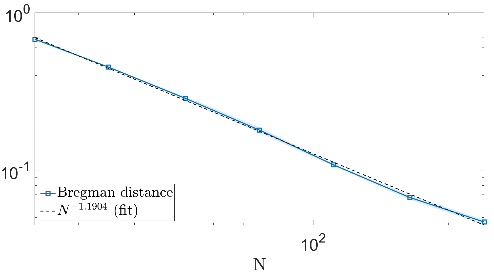

# randDynTomo

## Statistical inverse learning of randomly sampled sparse dynamic tomography
Numerical methods for estimating the Bregman distance decay rate using cylindrical shearlet regularization for dynamic tomography.

  

_Figure: Example plot of Bregman error decay. Cylindrical shearlets and $p=\frac{3}{2}$-norm is used for regularization._

These algorithms are used to produce the numerical results in  
> [T. A. Bubba](https://orcid.org/0000-0003-0020-9210), [T. Heikkilä](https://orcid.org/0000-0001-5505-8136), [D. Labate](https://orcid.org/0000-0002-9718-789X) and [L. Ratti](https://orcid.org/0000-0001-7948-0577),  
"Regularization with optimal space-time priors",  
_pre-print_ (2024). 

The references and necessary toolboxes are listed in the [credits](#credits).

## Contents

The repository contains the following files and folders.

**root**:

- `Main_cylSh_VMILAn_cluster.m`: the **main function** used to run the algorithm on different data, using different regularization methods (cylindrical shearlets or wavelets), noise models and parameters.

    **Key parameters**  
    - `dataset`: either 'Stempo' or 'Cartoon'
    - `p`: $\ell^p$-norm used for regularization. `p = 1` implemented separately and any `p > 1` should *in theory* work but in practice only certain values (such as `p = 1.5`) are implemented.
    - `transform`: 1 for *wavelets*, 2 for *cylindrical shearlets*, (0 for identity or *Tikhonov regularization*: NOT IMPLEMENTED!)
    - `c_alpha`: regularization parameter. One value per setup is enough, it is automatically tuned for different `N` based on the theoretical decay rate.
    - `fixed_noise`: 0 for *decreasing noise*, i.e. noise magnitude and `alpha` decrease at rate $N^{-1}$; 1 for *fixed noise*, i.e. noise magnitude remains constant and `alpha` decreases at rate $N^{-1/3}$ 
    - `Nsamp`: number of samples per `N`, i.e. how many times each test is run with new realizations of noise and random projection angles.
    - `Nangsamp`, `NangMin`, `NangMax`: number of random projection angles `N` get chosen from a logarithmically spaced sequence of `Nangsamp` values, where `NangMin` is the minimum `N` and `NangMax` is the maximum `N`. If `Nangsamp = 1`, use `N = NangMin`.
    - `c_delta`: noise level. One value per setup is enough, it is automatically tuned for different `N` based on the theoretical rate.

    **Other parameters**  
    - `wname`, `level`: change the wavelet family and decomposition level.
    - `decomp`, `dsize`, `level`: change the cylindrical shearlet parameters such as number of shearings, filter size and decomposition level.
    - `opts.` `x0`, `obj`, `tolstop`, `stopcrit`, `scaling`, `savefreq`: VMILA parameters for choosing starting point, "ground truth" for comparison, stopping tolerance, stopping criterion, option for adaptive bounds, how often iterates are stored.

- `VMILAn_CTrandomAngles_l*_NNconstraint.m`: function for calling the Variable Metric Inexact Line-search Algorithm (VMILA), `p = 1` and `p > 1` are implemented separately. Both use **Non-Negativity constraint**.

- `SGP_VMILAn_CTrandomAngles_l*_NNconstraint.m`: function for calling the Scaled Gradient Projection (SGP) algorithm to solve the dual problem during VMILA iteration, `p = 1` and `p > 1` are implemented separately. Both use **Non-Negativity constraint**.

- `CreateFinalPlots_ErrorBar.m`: function for generating the Bregman distance error plots used in the paper.

**data**:  

- `cartoonPhantom_256x256x*.mat`: simulated phantom at twice the desired spatial resolution (256 x 256) and two temporal resolutions: `T = 32` and `T = 64`. The data is simulated separately on the spot for the random projection angles.

- `stempo/stempo_cwtRecn_280x280x16.mat`: dynamic reconstruction from real tomography data using the [STEMPO device](https://zenodo.org/record/8239013). Regularized using [3D dual-tree complex wavelets](https://sigproc.eng.cam.ac.uk/foswiki/pub/Main/NGK/Chen_H_TIP_effreg_14may2011_submitted.pdf).

- **IMPORTANT**: The STEMPO data is NOT included in the repostory since it can be found on Zenodo: [10.5281/zenodo.8239013](https://zenodo.org/record/8239013). The `stempo_seq8x180_2d_b8.mat` data matches the 280x280x16 ground truth. See `stempo.md` for details.

**plots**: any plots created with `CreateFinalPlots_ErrorBar.m` are stored here.

**tools**: 

- `create_blkdiag_ct_operator_2d_*.m`: functions for creating block-diagonal CT operators for different 2D geometries. These rely on the [ASTRA Toolbox](#astra) and [HelTomo Toolbox](#heltomo).

- `extrapolate*CtData.m`: function for linearly extrapolating the random projections from real sinograms. There is a separate function for the STEMPO data.

- `prepareRandomData.m`: function for generating simulated data from a known phantom with twice the spatial resolution. No noise is added here!

- `external.md`: references to the external toolboxes necessary.

**tools/util**:

- `SH2feas.m`: project cylindrical shearlet coefficients (cell arrays) to the feasible region `[-bound, bound]`.

- `SHpnorm.m`: computes the $\frac{1}{p} \| U \|_p^p$ function from the given cylindrical shearlet coefficients $U$ (cell array).

- `cellnorm`: computes the $\ell^p$-norm from the given cylindrical shearlet coefficients (cell array).

- `SHsum.m`: linear combination $aU + bV$ of cylindrical shearlet coefficients $U$ and $V$, scaled by $a$ and $b$.

- `bregL1.m`: symmetric Bregman distance $B(u,v)$ between $u$ and $v$, where $p=1$ and $Mu$, $Mv$ are the already decomposed inputs. $ B(u,v) = \langle sgn(Mu) - sgn(Mv), Mu - Mv \rangle$. This implementation matches the choice $\partial | \cdot | = sgn(\cdot)$ for the subdifferential.

- `dec2waverec.m`: helper function for setting the wavelet coefficients in to a struct for `waverec3` to reconstruct.

- `setup_cylindrical_filters`: function for generating the cylindrical shearlet filters of desired size.

## Credits 

Original algorithm by **Tatiana A. Bubba** and **Luca Ratti**, used in  
> T. A. Bubba, M. Burger, T. Helin, and L. Ratti, "Convex regularization in statistical inverse learning problems", _Inverse Problems and Imaging_, 17, pp. 1193–1225 (2023).  

> T. A. Bubba and L. Ratti, "Shearlet-based regularization in statistical inverse learning with an application to x-ray tomography", 
_Inverse Problems_, p. 054001, (2022).

Adapted for dynamic tomography and 3D regularization by **Tommi Heikkilä**.

The minimization problem is solved with the Variable Metric Inexact Line-search Algorithm (**VMILA**) introduced in  
> S. Bonettini, I. Loris, F. Porta and M. Prato, "Variable metric inexact line-search based methods for nonsmooth optimization", _SIAM J. Optim._, 26 891–921, (2016).

The proximal operators require solving additional minimization problems. These are computed using the Scaled Gradient Projection (**SGP**) algorithm introduced in  
> S. Bonettini, R. Zanella and L. Zanni, "A scaled gradient projection method for constrained image deblurring", 
_Inverse Problems_ 25 015002, (2006).

The 3D Discrete Wavelet Transform is part of the [**Wavelet Toolbox**](https://www.mathworks.com/products/wavelet.html) and the **3D cylindrical shearlets** are based on
> G. R. Easley, K. Guo, D. Labate and B. R. Pahari, "Optimally sparse representations of cartoon-like cylindrical data", 
__The Journal of Geometric Analysis__ 31: 8926-8946, (2021).  
https://github.com/tommheik/3d_cylind_shear

The tomography forward operator is computed using the [**ASTRA Toolbox**](https://astra-toolbox.com/) 
> W. Van Aarle, W. J. Palenstijn, J. Cant, E. Janssens, F. Bleichrodt, A. Dabravolski, J. De Beenhouwer,
K. J. Batenburg and J. Sijbers, "Fast and flexible x-ray tomography using the ASTRA toolbox", 
_Opt. Express_ 24 25129–47 (2016).

> W. Van Aarle, W. J. Palenstijn, J. De Beenhouwer, T. Altantzis, S. Bals, K. J. Batenburg and J. Sijbers, "The ASTRA toolbox: a platform for advanced algorithm development in electron tomography", _Ultramicroscopy_ 157 35–47, (2015).

The algorithm also uses **Spot** and **HelTomo** 
> E. Van den Berg and M. P. Friedlander, "Spot - a linear-operator toolbox", v1.2, (2013) http://cs.ubc.ca/labs/scl/spot

> A. Meaney, "HelTomo - Helsinki Tomography Toolbox", v2.0.0, (2022) https://github.com/Diagonalizable/HelTomo